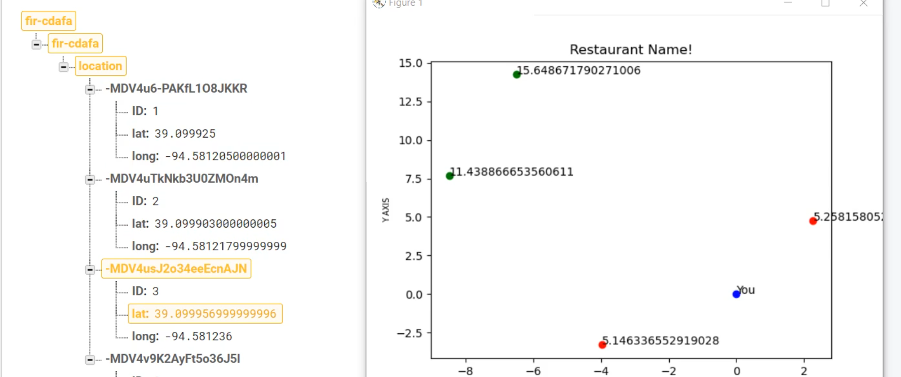
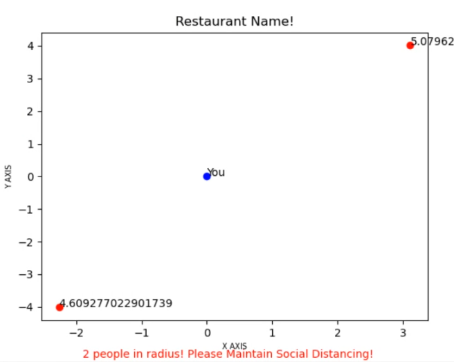
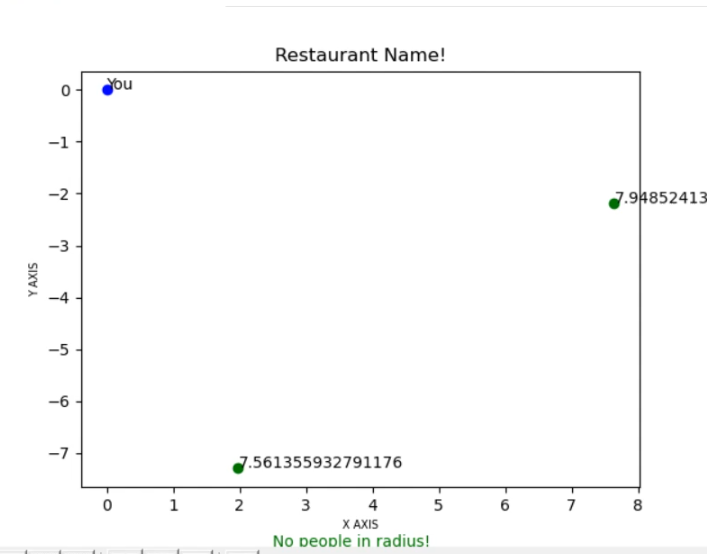

# SafeShop_Distance_Tracking_Algorithm
### Repository for Distance Tracking Algorithm 

In this pandemic season and lockdown, people are required to follow certain rules and regulations to reduce and prevent further spread of the virus. The goal of this algorithm is to check if people are maintaining proper social distancing or not in public places.

#### Overview:

Let's say the user has ordered something from a nearby restaurant and he has been allocated a pickup time. The user approaches the restaurant at the given time. When the user is within 10-15 feet of the restaurant, his GPS will start and his location (latitude and longitude) will be sent to Google FireBase Real-Time Database. 
(The same thing will be done for all the users who are within 10-15 feet range of the restaurant)

Now the distance and angle between every person will be calculated using the locations from FireBase and every user will get a live realtime graph displaying distance and the relative angle between him and every other user in the range of restaurant.
If the user is within 6 feet range of any person, he will be notified that there are people nearby in his range.
This algorithm will work continuously until as long as the user is inside the 10-15 feet range of restaurant.

The repository contains the code which will be used to send live location updates to FireBase and code for making a graph after reading data from FireBase.
Currently, the graph is generated using random data and the codes are in Python.
We will be converting the code to JAVA and integrating the code with the Mobile App in the future.

#### Tools and Technologies:
1. Python 3.x (matplotlib,firebase)
2. Google FireBase
3. We will be using JAVA in the future(for integrating algorithm with app)

#### Images:

  
   
  Realtime Update on FireBase

  

  
   
  People inside 6 feet range

  

  
   
  No one inside 6 feet range

